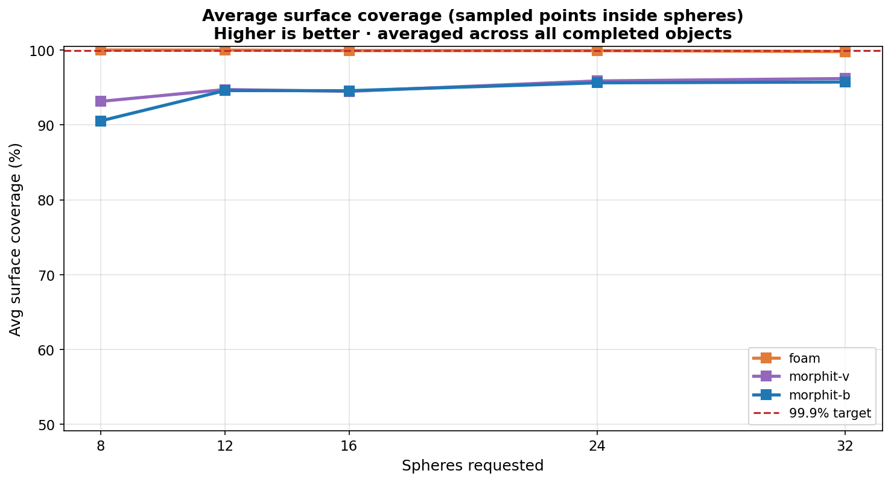
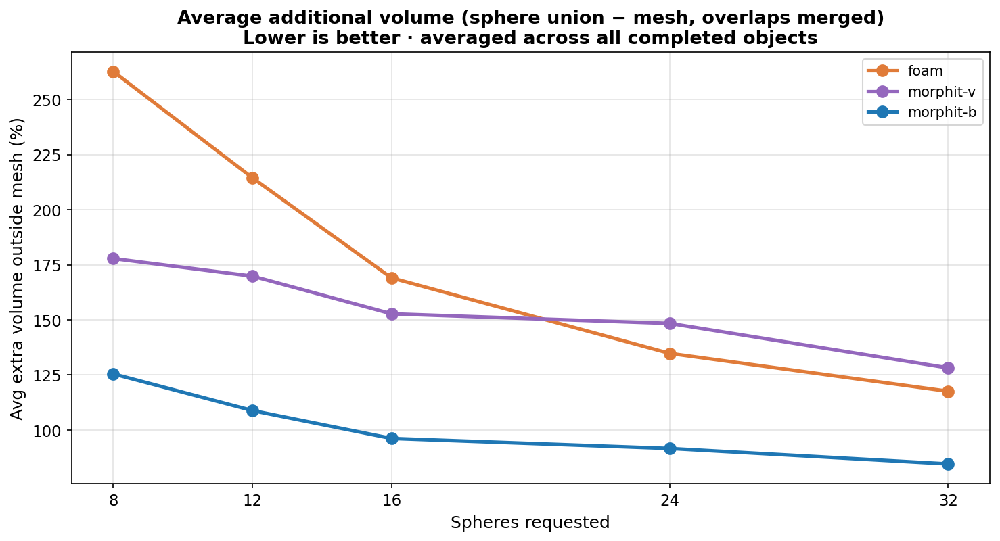

# Benchmarking sphere approximation for collision planning

I needed to approximate triangle meshes as unions of spheres for **Isaac cuMotion** offline motion planning. The planner cares about two things: whether the sphere union **covers the mesh surface** (gaps cause collisions to be missed), and how much **extra volume** the approximation adds (inflated obstacles shrink the feasible workspace).

I compared three approaches on eight public CAD baseline meshes:

| Method | Description |
|--------|-------------|
| **foam** (AMAA) | Medial-axis sphere tree via [foam](https://github.com/InteractiveComputerGraphics/foam) |
| **MorphIt-V** | Variable-radius spheres, volume-oriented variant |
| **MorphIt-B** | Variable-radius spheres, tightness-oriented variant |
| **VSSA** | Volume-minimizing sphere sets (evaluated, not included in final comparison) |

Sphere counts tested: **n = 8, 12, 16, 24, 32**. Surface tolerance ε = 1 mm.

---

## Interactive viewer

**[Open the 3D viewer →](https://shrish-multiplylabs.github.io/Sphere-Benchmarking/viewer/)**

Select a mesh and sphere count, then step through **CAD → foam → MorphIt-V → MorphIt-B** with the arrow keys (or the buttons). Each step overlays the sphere approximation on the original geometry so you can see where coverage holds and where it breaks down.

Meshes: bracket, car, cylinder, curve, foot, hub, mini_cow, nut.

---

## My conclusion

**Use foam when surface coverage is the priority.** Build time is seconds to tens of seconds on these baselines and is acceptable for offline preprocessing — runtime at planning time is not the bottleneck.

**MorphIt is fast but unreliable on concave geometry.** MorphIt-B produces the tightest sphere unions (lowest extra volume) but leaves large uncovered regions on shapes like the car model (~68–74% coverage even at n = 32). That is unsafe for collision planning: the robot can plan paths that intersect the real mesh.

**MorphIt-V sits in the middle** — good on convex-ish parts, weak on thin or concave features (e.g. 54% coverage on curve at n = 8).

**VSSA was not viable** for this workflow: mesh preparation requires a separate watertight manifold OBJ, the implementation is fragile, and the grid benchmark stalled before completing even the first configuration.

---

## Aggregate results

Across all successful runs on the eight CAD baselines:

| Method | Avg surface coverage | Avg extra volume | Avg build time |
|--------|---------------------|------------------|----------------|
| **foam** | **99.9%** | 177% | 26 s |
| MorphIt-V | 94.9% | 150% | 3 s |
| MorphIt-B | 94.2% | **95%** | 3 s |

foam hit ≥ 99.9% coverage in **36 of 40** runs. MorphIt-V did so in 11 of 40; MorphIt-B in 5 of 40.

### Surface coverage vs sphere count

foam maintains near-perfect coverage at every n. MorphIt methods improve with more spheres but never consistently match foam, especially on concave parts.

### Extra collision volume vs sphere count

MorphIt-B adds the least extra volume — the trade-off is the coverage gaps visible in the viewer. foam adds more volume but envelopes the surface reliably.

---

## Observations by mesh type

**Simple / convex (cylinder, nut, hub):** All three methods perform well. MorphIt-B is attractive here if you can verify coverage per mesh.

**Concave (car):** The clearest failure mode. MorphIt-B stays at 68–74% coverage across all n; foam stays at ~100%. This is the case that drove my method choice.

**High-detail thin features (curve):** MorphIt-V struggles early (54% at n = 8); foam reaches 100% immediately.

**General CAD (bracket, foot, mini_cow):** foam is consistently at or near 100%. MorphIt methods are usable on some meshes at higher n but require per-mesh validation.

---

## Metrics

Each run records:

- `surface_coverage_pct` — fraction of mesh surface within ε of the sphere union
- `extra_volume_pct` — volume of the union minus mesh volume, relative to mesh volume
- `runtime_s` — offline build time

Full results: [`data/baseline/metrics.csv`](data/baseline/metrics.csv)

---

## Methods not included

**VSSA** ([paper](https://gamma-web.iacs.umd.edu/vssa/)) minimizes sphere count for a given overlap volume and is theoretically strong, but in practice:

- Requires watertight manifold input (extra conversion step per mesh)
- Sensitive to mesh normals and compiler/toolchain issues
- Grid benchmark did not complete in reasonable time (`vssa / bracket / n=8` stalled)

I excluded it from the comparison rather than report incomplete data.

---

## Context

This benchmark supports sphere-based collision geometry for **NVIDIA Isaac cuMotion** on a UR manipulator. Sphere unions are exported to XRDF for the planner. The interactive viewer and CSV data in this repository are the complete public record of the CAD baseline study.
